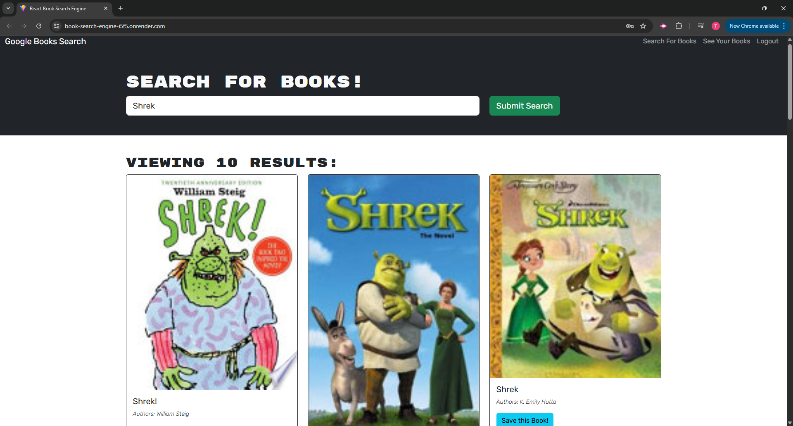
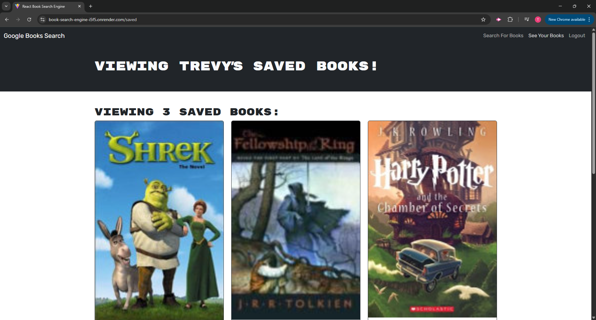

# Book-Search-Engine

  ## Description
  Most modern websites are driven by two things: data and user demands. This shouldn't come as a surprise, as the ability to personalize user data is the cornerstone of real-world web development today. As user demands evolve, applications need to be more performant. The Book Search Engine project takes a fully functioning Google Books API search application originally built with a RESTful API and refactors it into a GraphQL-powered API using Apollo Server. Built with the MERN stack (MongoDB, Express.js, React, Node.js), the app allows users to search for books and save favorites, with secure user authentication and database persistence.

  ## Table of Contents
  - [Installation](#installation)
  - [Usage](#usage)
  - [Technologies](#technologies)
  - [Screenshots](#screenshots)
  - [Walkthrough Video](#walkthrough-video)
  - [URL Link](#url-link)
  - [Contributing](#contributing)
  - [Contributors](#contributors)
  - [Tests](#tests)
  - [License](#license)
  - [Questions](#questions)

  ## Installation
  
  1. Git clone: git@github.com:Treevyy/Book-Search-Engine.git

  2. Navigate to the project directory: cd Book-Search-Engine

  3. Right click the root package.json file and click open in integrated terminal

  4. Inside the terminal install the dependencies with the command: npm i

  5. After dependencies are installed build the application with the command: npm run build

  6. Once the build is done run the application with the command: npm run develop

  ## Usage
  To run the Book Search Engine:

  1. Launch the app using the npm run develop command.

  2. Open your browser and navigate to http://localhost:3000.

  3. Search for books by title, author, or keyword using the search input field.

  4. If logged out, you can browse book results with title, author, description, cover image, and a Google Books link.

  5. Click Login/Signup to create an account or log into your profile.

  6. Once logged in, you can save favorite books to your account.

  7. Navigate to your Saved Books page to view or remove saved books.

  8. Logout to return to the public view.

  ## Technologies
 
 ### Frontend
  
  
  
  
  

### Backend
  
  
  
  
  
  
  
  
  

  ## Screenshots
  
  
  
  

  ## Walkthrough Video
  A demo of the application can be found at the following link: https://drive.google.com/file/d/1ex2rIb8SS0ChnlWKDdEgOl_A_gR0Q2HE/view

  ## URL Link
  The live deployed application is available at: https://book-search-engine-i5f5.onrender.com
  
  ## Contributing
  No contributions are needed for this project

  ## Contributors
  Thank you to all the TA's, Tutors and Professor for all your help during this challenge!

  1. Trevor Moore aka Treevyy

  2. Quentin Jones - TA

  3. Andrea Presto - TA

  4. Joem Casusi - Tutor

  5. Chris Baird - Tutor

  6. Dan Mueller - Professor

  ## Tests
  
  1. Make sure the latest version of node is installed, check by using the command: node -v in your terminal

  2. Run the development server: npm run develop

  3. Manually verify functionality by following the User Story and Acceptance Criteria in the application.

  ## License
  This project is licensed under the MIT license.

  ## Questions
  If you have any additional questions, you can contact me at:
  - GitHub: [Treevyy](https://github.com/Treevyy)
  - Email: [aarontrevormoore@gmail.com](mailto:aarontrevormoore@gmail.com)